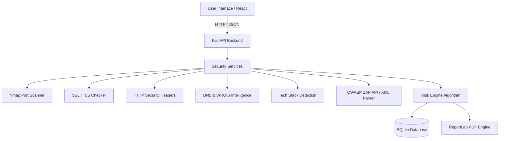

# SentinelX — Digital Security Assessment and Reporting System

[](https://github.com/adyotohrii-debug/SentinelX)
[](https://fastapi.tiangolo.com/)
[](https://reactjs.org/)
[](LICENSE)

**SentinelX** is a professional, high-performance Digital Security Assessment and Reporting Platform designed to evaluate attack surfaces, discover misconfigurations, calculate risk exposure, and generate comprehensive PDF audit reports for security teams and organization leaders.

---

## 🚀 Key Features

- **🌐 Website Security Assessment**: Comprehensive passive reconnaissance covering HTTP Security Headers, SSL/TLS Certificates, Open Ports, Server Information, WHOIS records, DNS resolution, and Technology Stack Detection.
- **⚡ Nmap Port Scanner Integration**: Fast, automated environment detection and port analysis using Nmap binary execution when available.
- **🛡️ OWASP ZAP Support**: Real-time REST API reachability status checking, local OWASP ZAP instance monitoring, and full OWASP ZAP XML report import parsing.
- **📊 Operational Security Dashboard**: Live posture score ring, findings by severity, exposure breakdown charts, and real-time backend tool health indicators.
- **📈 Advanced Risk Engine**: Multi-vector risk score algorithm incorporating security headers, SSL status, dangerous ports, technology exposures, and OWASP findings.
- **📄 Extended PDF Report Generation**: Professional, downloadable ReportLab PDF reports containing Executive Summaries, Tool Status Matrix, Risk Distribution, OWASP Findings, and Remediation Recommendations.
- **📂 Persistent Scan History**: Centralized scan archive storing all previous assessments and imported XML/JSON files for instant review and export.

---

## 🛠️ Technology Stack

| Layer | Technology |
| :--- | :--- |
| **Frontend UI** | React 18, Vite, React Router DOM, Lucide Icons, Recharts |
| **Backend API** | FastAPI, Python 3.10+, Uvicorn |
| **Database** | SQLite, SQLAlchemy ORM |
| **PDF Generation** | ReportLab |
| **Security Tools** | Nmap CLI, OWASP ZAP REST API, Python `whois`, `dnspython` |

---

## 📁 Folder Structure

```text
SentinelX/
├── backend/
│   ├── app/
│   │   ├── api/             # FastAPI Endpoint Routers (security, upload, assessment, dashboard, reports)
│   │   ├── core/            # Database Session & Configuration
│   │   ├── models/          # SQLAlchemy Models (Assessment, Finding)
│   │   ├── schemas/         # Pydantic Schemas
│   │   ├── services/        # Security Intelligence, Risk Engine, PDF & Upload Services
│   │   └── main.py          # FastAPI Application Entrypoint
│   ├── requirements.txt     # Python Dependencies
│   └── sentinelx.db         # SQLite Database
├── frontend/
│   ├── public/              # Static Web Assets
│   ├── src/
│   │   ├── components/      # Reusable Components (ToolStatusCard, Topbar, Sidebar, PDFReport)
│   │   ├── layouts/         # Page Layout Wrappers
│   │   ├── pages/           # Pages (Dashboard, Assessment, Reports, History, OwaspSetup, About)
│   │   ├── services/        # Axios API Client
│   │   └── styles/          # Modular CSS Stylesheets
│   └── package.json         # Node Dependencies
├── docs/                    # Technical & Architectural Documentation
├── docker-compose.yml       # Container Deployment Config
├── README.md                # Project Overview & Setup Guide
└── CHANGELOG.md             # Version 2.0 Change History
```

---

## ⚙️ Installation & Setup Guide

### 1. Prerequisites
- **Python 3.10+**
- **Node.js 18+ & npm**
- *(Optional)* **Nmap** installed and available in system `PATH`.
- *(Optional)* **OWASP ZAP** installed and running on default port `8080`.

### 2. Backend Setup
```bash
# Navigate to backend directory
cd backend

# Create virtual environment
python -m venv venv

# Activate virtual environment
# Windows:
.\venv\Scripts\activate
# Linux/macOS:
source venv/bin/activate

# Install dependencies
pip install -r requirements.txt

# Start FastAPI server
uvicorn app.main:app --reload --host 127.0.0.1 --port 8000
```
Backend server will be running at `http://127.0.0.1:8000`.

### 3. Frontend Setup
```bash
# Navigate to frontend directory
cd frontend

# Install dependencies
npm install

# Start Vite dev server
npm run dev
```
Frontend application will be accessible at `http://localhost:5173`.

---

## 🛡️ Optional OWASP ZAP Setup

SentinelX seamlessly integrates with OWASP ZAP for enhanced vulnerability reporting:
1. Download & install OWASP ZAP from [https://www.zaproxy.org/download/](https://www.zaproxy.org/download/).
2. Start OWASP ZAP on your local machine (default API port `8080`).
3. SentinelX automatically detects ZAP API reachability on the backend execution machine and updates the **Tool Status** indicators across the application.
4. If ZAP is not running, SentinelX continues operating normally using all other security modules without errors.

---

## 📖 System Architecture & Workflow



---

## 📄 License & Attribution

SentinelX is developed for security posture management, digital risk assessment, and technical reporting.

Developed by the **SentinelX Engineering Team**.
