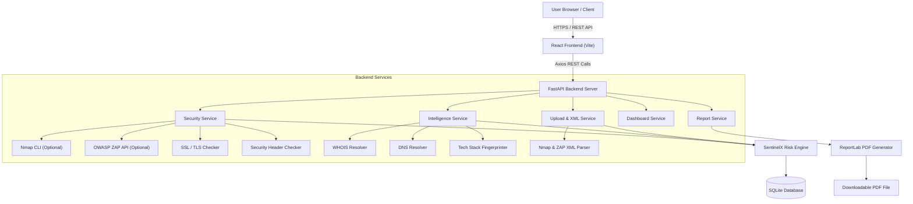
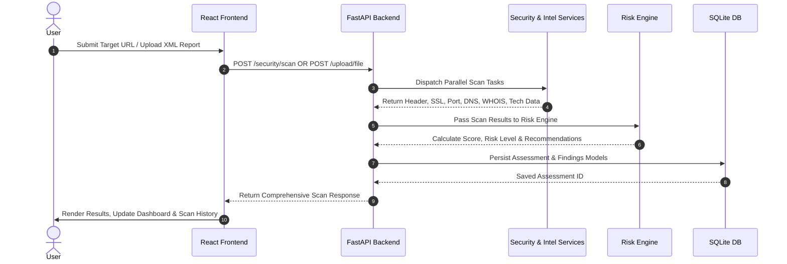
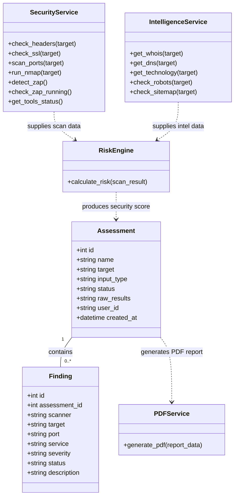

# SentinelX — System Architecture

## 1. High Level Architecture Diagram

```mermaid
graph TD
    Client["User Browser / Client"] -->|HTTPS / REST API| Frontend["React Frontend (Vite)"]
    Frontend -->|Axios REST Calls| API["FastAPI Backend Server"]

    subgraph Backend Services
        API --> SecuritySvc["Security Service"]
        API --> IntelSvc["Intelligence Service"]
        API --> UploadSvc["Upload & XML Service"]
        API --> DashboardSvc["Dashboard Service"]
        API --> ReportSvc["Report Service"]

        SecuritySvc --> NmapTool["Nmap CLI (Optional)"]
        SecuritySvc --> ZAPTool["OWASP ZAP API (Optional)"]
        SecuritySvc --> SSLTool["SSL / TLS Checker"]
        SecuritySvc --> HeaderTool["Security Header Checker"]

        IntelSvc --> WHOISTool["WHOIS Resolver"]
        IntelSvc --> DNSTool["DNS Resolver"]
        IntelSvc --> TechTool["Tech Stack Fingerprinter"]

        UploadSvc --> XMLParser["Nmap & ZAP XML Parser"]
    end

    SecuritySvc --> RiskEngine["SentinelX Risk Engine"]
    IntelSvc --> RiskEngine
    UploadSvc --> RiskEngine

    RiskEngine --> DB[(SQLite Database)]
    ReportSvc --> PDFEngine["ReportLab PDF Generator"]
    PDFEngine --> StreamPDF["Downloadable PDF File"]
```

---

## 2. Assessment Workflow Diagram

```mermaid
sequenceDiagram
    autonumber
    actor User
    participant UI as React Frontend
    participant API as FastAPI Backend
    participant Scan as Security & Intel Services
    participant Risk as Risk Engine
    participant DB as SQLite DB

    User->>UI: Submit Target URL / Upload XML Report
    UI->>API: POST /security/scan OR POST /upload/file
    API->>Scan: Dispatch Parallel Scan Tasks
    Scan-->>API: Return Header, SSL, Port, DNS, WHOIS, Tech Data
    API->>Risk: Pass Scan Results to Risk Engine
    Risk-->>API: Calculate Score, Risk Level & Recommendations
    API->>DB: Persist Assessment & Findings Models
    DB-->>API: Saved Assessment ID
    API-->>UI: Return Comprehensive Scan Response
    UI->>User: Render Results, Update Dashboard & Scan History
```

---

## 3. Module Relationship Diagram

```mermaid
classDiagram
    class Assessment {
        +int id
        +string name
        +string target
        +string input_type
        +string status
        +string raw_results
        +string user_id
        +datetime created_at
    }

    class Finding {
        +int id
        +int assessment_id
        +string scanner
        +string target
        +string port
        +string service
        +string severity
        +string status
        +string description
    }

    class SecurityService {
        +check_headers(target)
        +check_ssl(target)
        +scan_ports(target)
        +run_nmap(target)
        +detect_zap()
        +check_zap_running()
        +get_tools_status()
    }

    class IntelligenceService {
        +get_whois(target)
        +get_dns(target)
        +get_technology(target)
        +check_robots(target)
        +check_sitemap(target)
    }

    class RiskEngine {
        +calculate_risk(scan_result)
    }

    class PDFService {
        +generate_pdf(report_data)
    }

    Assessment "1" -- "0..*" Finding : contains
    SecurityService ..> RiskEngine : supplies scan data
    IntelligenceService ..> RiskEngine : supplies intel data
    RiskEngine ..> Assessment : produces security score
    Assessment ..> PDFService : generates PDF report
```
